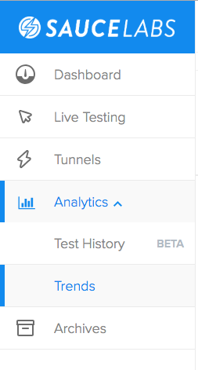
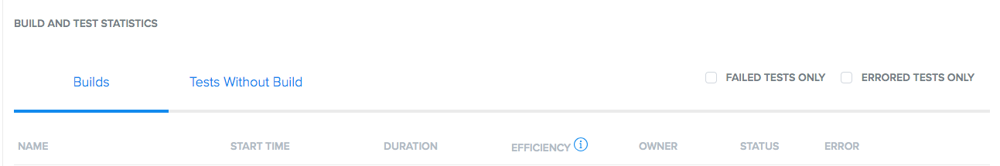
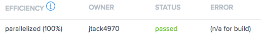

# Exercise 6: Test Code Parallelization
## Part One: Configure Parallelization in `pom.xml`:

1. Checkout the branch `06_test_parallelization`
2. Open up the `pom.xml` and modify the following `plugin` setting:
    * Before:
    ```
    <configuration>
        <parallel>classes</parallel>
        <threadCount>1</threadCount>
        <redirectTestOutputToFile>false</redirectTestOutputToFile>
    </configuration>
    ```
    * After:
    ```
    <configuration>
        <parallel>methods</parallel>
        <threadCount>10</threadCount>
        <redirectTestOutputToFile>false</redirectTestOutputToFile>
    </configuration>
    ```
3. In `BaseTest` change the `"build"` tag so that SauceLabs logs the tests as a different build, for example:
    * Before:
    ```
     sauceOpts.setCapability("build", "saucecon19-best-practices");
    ```
    * After:
    ```
     sauceOpts.setCapability("build", "saucecon19-best-practices-v0.0.1");
    ```
4. Navigate to saucelabs.com and open the Analytics tab. Go to the **Trends** tab: 
    
    
    
6. Change the **Time** parameter to **Last 15 mins**
    
    
    
7. Scroll down to the bottom to **Build and Test Statistics**:
    
    
    
8. Your build efficiency should read somewhere around **semi-parallel (44%)**,. Go back to `pom.xml` and change the parallel execution to **`classes`** level, e.g.:
    ```
    <groupId>org.apache.maven.plugins</groupId>
    <artifactId>maven-surefire-plugin</artifactId>
    <version>2.22.1</version>
    <configuration>
        <parallel>classes</parallel>
        <threadCount>10</threadCount>
        <redirectTestOutputToFile>false</redirectTestOutputToFile>
    </configuration>
    ```
9. In `BaseTest` change the `"build"` tag again to compare the differences (make sure you also **"import Maven changes"** whenever changing the `pom.xml`:
    * Before
    ```
     sauceOpts.setCapability("build", "saucecon19-best-practices-v0.0.1");
    ```
    * After
    ```
     sauceOpts.setCapability("build", "saucecon19-best-practices-v0.0.2");
    ```
10. Save all and re-run your tests:
    ```
    mvn test
    ```
    the **Build and Test Statistics** tab should now show the current build runs as **parallelized (100%)** in the **Efficiency** tab:

    